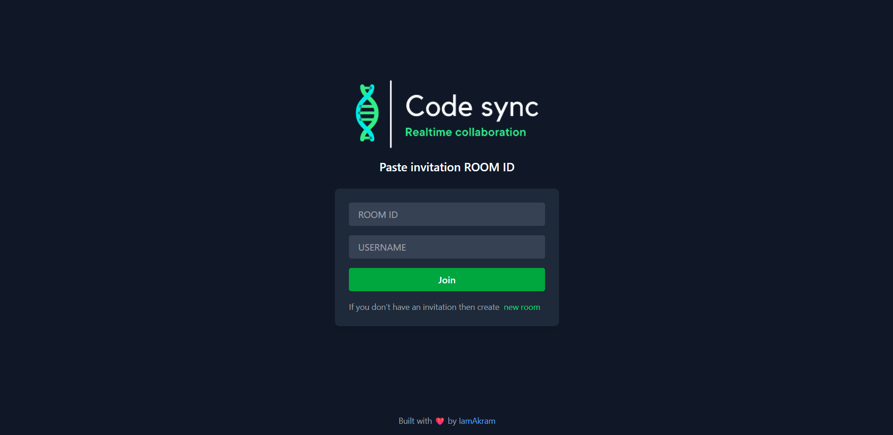
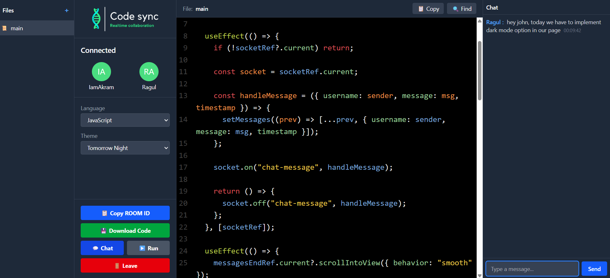

# 📝 Real-Time Collaborative Code Editor

A real-time collaborative code editor where multiple users can write, edit, and share code simultaneously.  
Built with **React, Node.js, and WebSockets** to enable seamless collaboration.

---

## 🚀 Features
- 🔗 Real-time code synchronization across multiple clients.
- 👥 Multiple users can join the same room and collaborate.
- ⚡ Built on **WebSockets** for instant updates.
- 🎨 Simple and intuitive UI for smooth coding experience.
- 📂 Easy room creation and sharing via unique room IDs.

---

## 🛠️ Tech Stack
- **Frontend:** React, Vite, CSS
- **Backend:** Node.js, Express
- **Communication:** Socket.IO (WebSockets)
- **Other Tools:** ESLint, Git

---

## 📸 Screenshots

### Homepage


### Editor Page


---

## ⚙️ Installation & Setup

Clone the repository and install dependencies:

```bash
# Clone the repo
git clone https://github.com/iamakram321/code-editor.git

# Navigate to project folder
cd code-editor

# Install dependencies
npm install

# Run the server
node server.js

# Run the frontend (in another terminal)
npm run dev

🚀 How It Works

A user creates a new room.

Other users join using the room ID.

All code changes are synced in real time using Socket.IO.

When a user leaves, others can continue editing without interruptions.

📌 Future Enhancements

✅ Add authentication & user profiles.

✅ Support multiple programming languages & themes.

✅ Add live code execution and debugging.

✅ Enable video/audio chat for better collaboration.

🤝 Contributing

Contributions are welcome! Feel free to fork the repo and submit pull requests.
